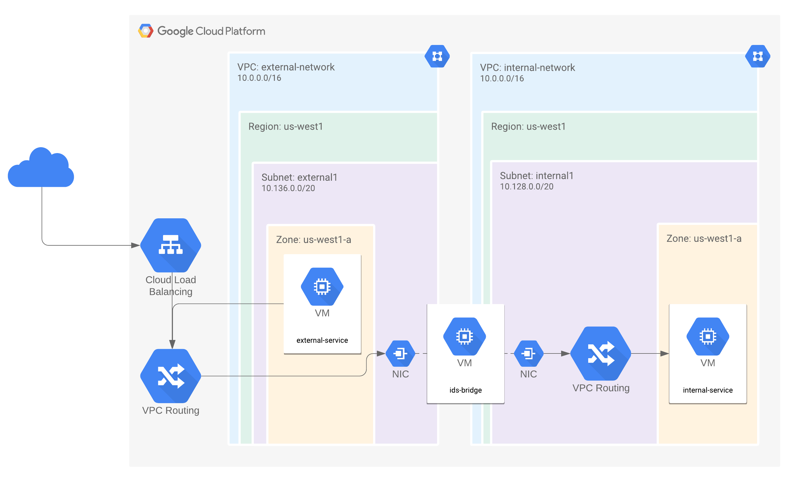

# Setup IDS on GCP
This repository contains a few handy scripts to help with setting up a simple IDS implementation on GCP.

`setup_ids_project.sh` builds the inline (aka perimeter) IDS architecture (see image below), setting up the networks, subnets, routes, firewall-rules, and instances for a simple inline architecture. Its configuration is available via `setup_ids_project.sh -h`.

## Installation

### Snort 3.0
This repository has scripts to help you get setup with Snort 3.0 in an inline configuration, using the community rules and default configuration. These can be easily modified for an on-host implementation.

#### Instructions
1. Clone this repository and `cd` into it. Enter into your project via `gcloud config set project $PROJECT_ID`
1. Run `./setup_snort_on_gcp.sh -p $PROJECT_ID -z $ZONE`
  * Optionally, run `./setup_snort_on_gcp.sh -d -p $PROJECT_ID -z $ZONE` to start from a clean slate. **THIS WILL DELETE THE NETWORK AND INSTANCE CONFIGURATION SETUP BY THIS SCRIPT IF IT ALREADY EXISTS**
  * `setup_snort_on_gcp.sh` invokes `setup_ids_project.sh` to build out the architecture for this inline implementation.
1. Once the installation is complete (about 15-20 minutes), you are ready to get started with Snort 3.0! See the [Testing](#testing) section to test your IDS.

### Suricata
This repository contains scripts to help you get setup with Suricata 3.2.1 and 4.1.5, with the former build from a binary and the latter being built from source.

#### Instructions
1. Clone this repository and `cd` into it. Enter into your project via `gcloud config set project $PROJECT_ID`
1. Run `./setup_suricata_on_gcp.sh -p $PROJECT_ID -z $ZONE`
  * Optionally, run `./setup_suricata_on_gcp.sh -d -p $PROJECT_ID -z $ZONE` to start from a clean slate. **THIS WILL DELETE THE NETWORK AND INSTANCE CONFIGURATION SETUP BY THIS SCRIPT IF IT ALREADY EXISTS**
  * `setup_suricata_on_gcp.sh` invokes `setup_ids_project.sh` to build out the architecture for an inline implementation.
  * `setup_suricata_on_gcp.sh` invokes `suricata/install_suricata_3.2.1.sh` to install Suricata 3.2.1 from a binary. To install Suricata 4.1.5 from a binary, modify `setup_suricata_on_gcp.sh` to invoke `suricata/install_suricata_4.1.5.sh`
1. Once the installation is complete (about 15-20 minutes), you are ready to get started with Suricata! See the [Testing](#testing) section to test your IDS.

## Testing
The test scripts are launched from the `external-service`, an instance sitting in the `external` network, and simulates a few attacks to your `internal-service` which sits in the internal network.

`test_ids.sh` contains the tests for:

* TCP FIN Scan
* TCP Xmas Scan
* Ping +++ATH DoS
* Land DoS

And should generate alerts for the IDS of your choosing if they are setup correctly.

To run this simple test suite, simply run `./test_ids.sh`.
